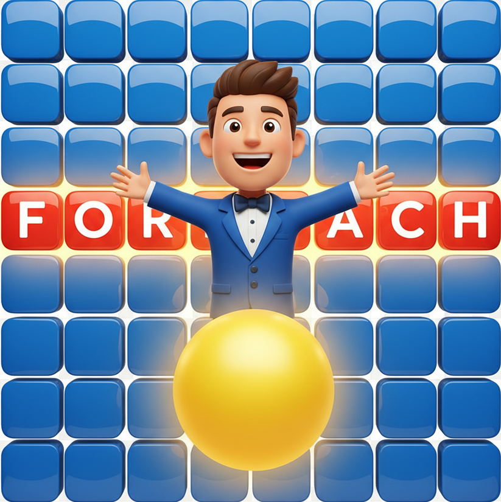

#  MOTUS - Jeu de Mots Interactif

Un jeu de mots inspiré du célèbre jeu télévisé français MOTUS, développé en HTML, CSS et JavaScript.



##  Description

MOTUS est un jeu de réflexion où le joueur doit deviner un mot de 5 lettres en un nombre limité de tentatives. Chaque tentative révèle des indices sur la position des lettres dans le mot mystère.

##  Fonctionnalités

### Gameplay Principal
- **Mécanisme de jeu authentique** : Reproduit fidèlement les règles du MOTUS télévisé
- **Validation en temps réel** : Vérification instantanée des mots saisis
- **Système d'indices visuels** :
  - 🔴 Rouge : Lettre correcte à la bonne position
  - 🟡 Jaune : Lettre correcte mais mal placée
  - ⚫ Gris : Lettre absente du mot
- **Première lettre révélée** : La première lettre du mot est toujours donnée

### 🎵 SFX
- **Musique d'ambiance** : Générique original du MOTUS
- **Effets sonores** :
  - Son de victoire 
  - Son de défaite 
  - Son d'erreur 
- **Règles audio** : Explication sonore des règles du jeu pour l'accessibilité

### Système de Scores et Statistiques
- **Points en temps réel** : Système de scoring basé sur la performance
- **Statistiques détaillées** :
  - Nombre total de parties jouées
  - Taux de victoire
  - Moyenne de tentatives par partie
  - Historique des 10 dernières parties
- **Meilleur score** : Suivi du record personnel

### Chronomètre Intelligent
- **Temps limité** : 2 minutes par partie
- **Alertes visuelles** :
  - Vert : Temps normal
  - Jaune : Avertissement (30 secondes restantes)
  - Rouge clignotant : Temps critique (10 secondes restantes)

### Avatar Interactif
- **Personnage animé** : Petit bonhomme interactif sur le côté de l'écran
- **Messages d'encouragement** : messages aléatoires motivants (ou pas)
- **Animation fluide** : Transition entre deux états (caché/visible)
- **Bulle de dialogue** : Interface de communication avec le joueur

###  Interface Utilisateur
- **Design moderne** : Interface épurée et responsive
- **Clavier virtuel** : Saisie tactile avec retour visuel
- **Animations CSS** : Effets de retournement des lettres
- **Mode responsive** : Adapté aux différentes tailles d'écran

##  Comment Jouer

1. **Objectif** : Devinez le mot de 5 lettres en 6 tentatives maximum
2. **Première lettre** : Elle est automatiquement révélée
3. **Saisie** : Tapez votre proposition ou utilisez le clavier virtuel
4. **Validation** : Cliquez sur "Valider" ou appuyez sur Entrée pour submit le mot
5. **Indices** : Observez les couleurs pour ajuster votre stratégie
6. **Victoire** : Trouvez le mot dans le temps imparti !

## 🛠️ Technologies Utilisées

- **HTML5** : Structure simple et accessible
- **CSS3** : 
  - Flexbox et Grid pour le layout ( à l'aide de la maquette figma entre autre)
  - Animations et transitions CSS
  - Design responsive
  - Variables CSS pour la cohérence des couleurs
- **JavaScript Vanilla** :
  - Logique de jeu complète
  - Gestion des événements
  - API localStorage pour la persistance
  - Manipulation du DOM

## 📁 Structure du Projet

```
PROJET MOTUS/
├── index.html             # Page d'accueil
├── game.html              # Interface de jeu
├── game.js                # Logique JavaScript principale
├── style.css              # Styles CSS complets
├── motus-logo.png         # Logo principal
├── iconemotus.ico         # Icône du site
├── perso side page.png    # Avatar (position cachée)
├── perso clicky.png       # Avatar (position visible)
├── MOTUS [L'intégralité du générique].mp3  # Musique principale
├── motusWin.mp3           # Son de victoire
├── motusLose.mp3          # Son de défaite
├── motusError.mp3         # Son d'erreur
├── reglesdujeu.mp3        # Règles audio
├── gameversion1(obsolete).js  # Ancienne version
└── README.md              # Documentation du projet
```

##  Installation et Utilisation

### Prérequis
- Un navigateur web moderne (Chrome, Firefox, Safari, Brave etc..)
- Aucune installation supplémentaire requise

### Lancement
1. Clonez ou téléchargez le repository
2. Ouvrez `index.html` dans votre navigateur
3. Cliquez sur "Commencer une partie"
4. Amusez-vous ! 


##  Fonctionnalités Avancées

### Système de Points
- **Victoire rapide** : Bonus de temps
- **Peu de tentatives** : Bonus d'efficacité
- **Série de victoires** : Multiplicateur de points

### Persistance des Données
- Sauvegarde automatique des statistiques ( en local )
- Conservation du meilleur score ( en local )
- Historique des parties précédentes


### Améliorations Futures Possibles
- [ ] Mode multijoueur en ligne
- [ ] Dictionnaire de mots personnalisable
- [ ] Thèmes visuels alternatifs
- [ ] Mode entraînement sans limite de temps
- [ ] Partage des scores sur les réseaux sociaux

##  Contribution

Les contributions sont les bienvenues ! N'hésitez pas à :
- Signaler des bugs
- Proposer des améliorations
- Soumettre des pull requests

##  Remerciements

- Inspiré du jeu télévisé MOTUS de France 2

---

**Développé par Jeremy, Balou, Cedric et Anisse !

*Amusez-vous bien et que les mots soient avec vous ! 